[TOC]

* [图解git](#图解git)
  * [基础](#基础)
    * [1 git commit](#1-git-commit)
    * [2 git branch](#2-git-branch)
    * [3 git merge 分支的合并](#3-git-merge-分支的合并)
    * [4 git rebase](#4-git-rebase)
  * [高级](#高级)
    * [1 Head](#1-head)
    * [2 相对引用 ^](#2-相对引用-)
    * [3 相对引用 ~](#3-相对引用-)
    * [4 撤销变更 reset&amp;revert](#4-撤销变更-resetrevert)
  * [移动提交记录](#移动提交记录)
    * [1 cherry\-pick](#1-cherry-pick)
    * [2 交互式的rebase](#2-交互式的rebase)
  * [杂项](#杂项)
    * [1 只取一个提交记录](#1-只取一个提交记录)
    * [2  提交的技巧](#2--提交的技巧)
    * [3 提交的技巧](#3-提交的技巧)
    * [4 git tags](#4-git-tags)
    * [5 git describe](#5-git-describe)
    * [6 多次rebase](#6-多次rebase)
    * [7 多个父节点](#7-多个父节点)

# 图解git #

https://oschina.gitee.io/learn-git-branching/  可视化git

## 基础 ##

### 1 git commit ###

Git 仓库中的提交记录保存的是你的目录下所有文件的**快照**，就像是把整个目录复制，然后再粘贴一样，但比复制粘贴优雅许多！

Git 希望提交记录尽可能地轻量，因此在你每次进行提交时，它并不会盲目地复制整个目录。条件允许的情况下，它会将**当前版本与仓库中的上一个版本进行对比，并把所有的差异打包到一起作为一个提交记录**。

Git 还保存了提交的历史记录。这也是为什么大多数提交记录的上面**都有父节点**的原因 —— 我们会在图示中用箭头来表示这种关系。对于项目组的成员来说，维护提交历史对大家都有好处。

关于提交记录太深入的东西咱们就不再继续探讨了，现在你可以把提交记录看作是项目的快照。提交记录非常轻量，可以快速地在这些提交记录之间切换！

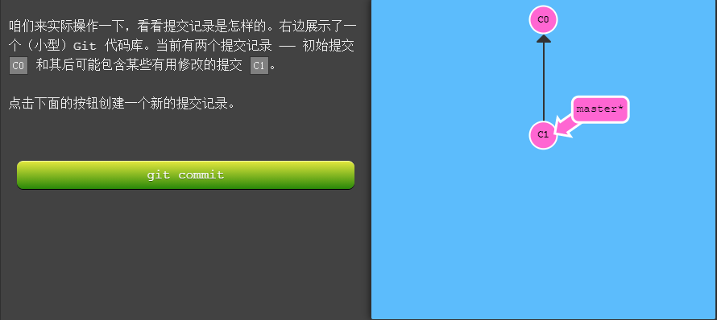

**git commit** 

我们刚才修改了代码库，并把这些修改保存成了一个提交记录 `C2`。`C2` 的父节点是 `C1`，父节点是当前提交中变更的基础。

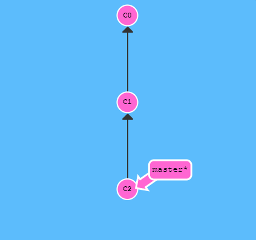

### 2 git branch ###

Git 的分支也非常轻量。它们只是简单地指向某个提交纪录 —— 仅此而已。所以许多 Git 爱好者传颂：早建分支！多用分支！

这是因为即使**创建再多分的支也不会造成储存或内存上的开销**，并且按逻辑分解工作到不同的分支要比维护那些特别臃肿的分支简单多了。

在将分支和提交记录结合起来后，我们会看到两者如何协作。现在只要记住使用分支其实就相当于在说：“我想基于这个提交以及它所有的父提交进行新的工作。”

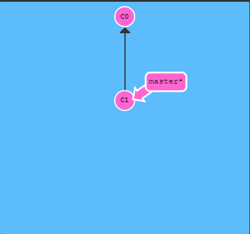

**git branch newImage**

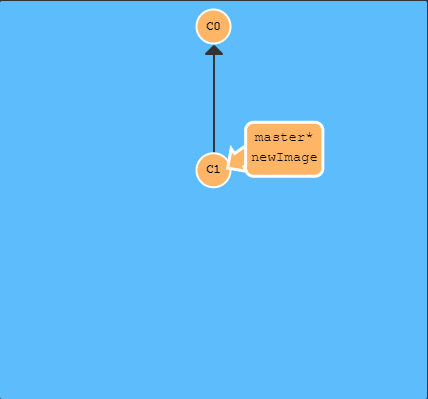

创建的新分支指向的是目前的提交记录C1。分支上的*****代表当前所在分支是master. git commit 会使master向下产生一个子节点，newImage不变

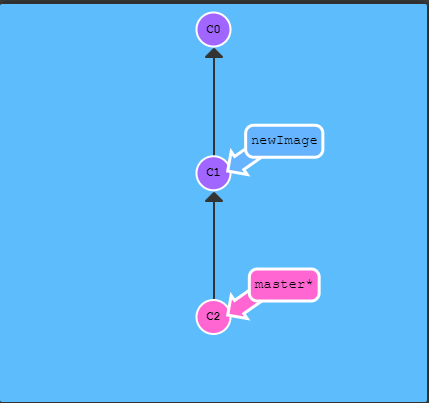

**git checkout newImage** ;  //切换分支

git commit;

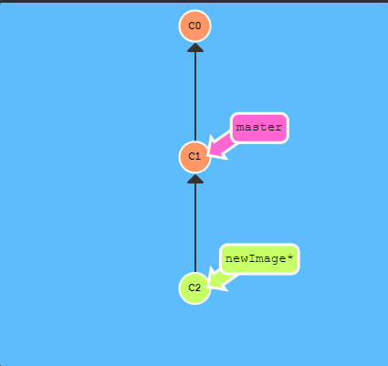

**git checkout -b branch-name**;  //创建新分支同时切换到对应分支

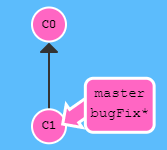

git checkout -b bugFix;

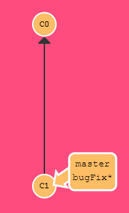

### 3 git merge 分支的合并 ###

太好了! 我们已经知道如何提交以及如何使用分支了。接下来咱们看看如何将两个分支合并到一起。就是说我们新建一个分支，在其上开发某个新功能，开发完成后再合并回主线。

咱们先来看一下第一种方法 —— `git merge`。在 Git 中合并两个分支时会产生一个特殊的提交记录，它有两个父节点。翻译成自然语言相当于：“我要把这两个父节点本身及它们所有的祖先都包含进来。”

两个分支，每个分支上各有一个独有的提交。这意味着没有一个分支包含了我们修改的所有内容。咱们通过合并这两个分支来解决这个问题。我们要把 `bugFix` 合并到 `master` 里

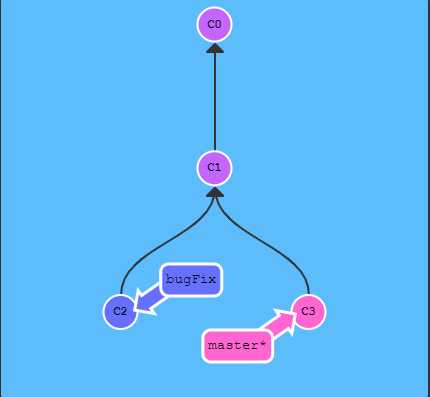

**git merge bugFix** //merge 的主语是当前分支(*)，所以变化的只有当前分支

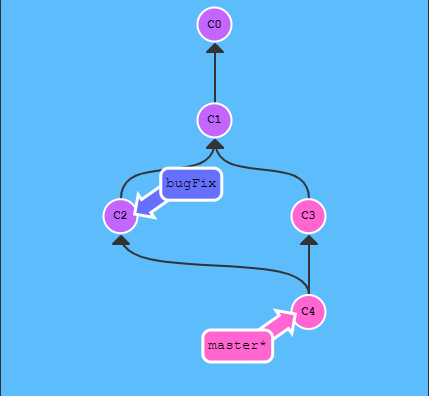

首先，`master` 现在指向了一个拥有两个父节点的提交记录。假如从 `master` 开始沿着箭头向上看，在到达起点的路上会经过所有的提交记录。这意味着 `master` 包含了对代码库的所有修改。

再把master 分支合并到 bugFix

**git checkout bugFix; git merge master;**

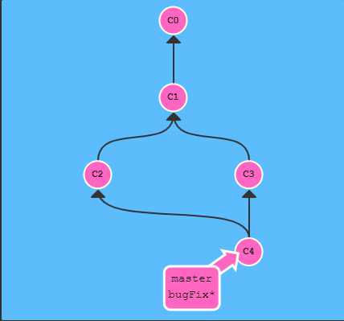

merge是**找到/创建**两个父节点公共的子节点

### 4 git rebase ###

第二种合并分支的方法是 `git rebase`。Rebase 实际上就是取出一系列的提交记录，“复制”它们，然后在另外一个地方逐个的放下去。

Rebase 的优势就是可以**创造更线性的提交历史**，这听上去有些难以理解。如果只允许使用 Rebase 的话，代码库的提交历史将会变得异常清晰。

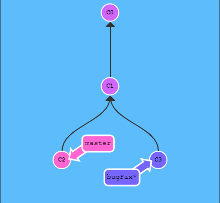

还是准备了两个分支；注意当前所在的分支是 bugFix（星号标识的是当前分支）

我们想要把 bugFix 分支里的工作直接移到 master 分支上。移动以后会使得两个分支的功能看起来像是按顺序开发，但实际上它们是并行开发的。

咱们这次用 `git rebase` 实现此目标

**git rebase master**

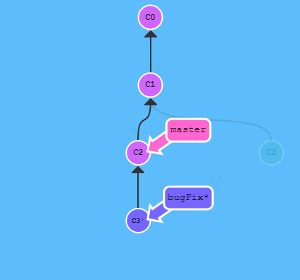

现在 bugFix 分支上的工作在 master 的最顶端，同时我们也得到了一个更线性的提交序列。

注意，提交记录 C3 依然存在（树上那个半透明的节点），而 C3' 是我们 Rebase 到 master 分支上的 C3 的副本。

现在唯一的问题就是 master 还没有更新

**git checkout master; git rebase bugFix;**

由于 `bugFix` 继承自 `master`，所以 Git 只是简单的把 `master` 分支的引用向前移动了一下而已。

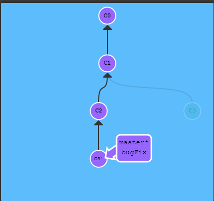

rebase 顾名思义，相当于更换当前分支的父节点

## 高级 ##

### 1 Head ###

在接触 Git 更高级功能之前，我们有必要先学习在你项目的提交树上前后移动的几种方法。

我们首先看一下 “HEAD”。 HEAD 是一个对当前检出记录的符号引用 —— 也就是指向你正在其基础上进行工作的提交记录。

HEAD 总是指向当前分支上最近一次提交记录。大多数修改提交树的 Git 命令都是从改变 HEAD 的指向开始的。

HEAD 通常情况下是指向分支名的（如 bugFix）。在你提交时，改变了 bugFix 的状态，这一变化通过 HEAD 变得可见。

git checkout c1; git checkout master; git commit; git checkout c2;

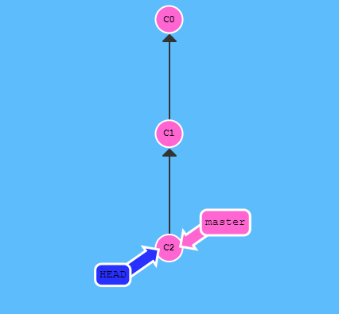

实际这些命令并不是真的在查看 HEAD 指向，看下一屏就了解了。如果想看 HEAD 指向，可以通过 `cat .git/HEAD` 查看， 如果 HEAD 指向的是一个引用，还可以用 `git symbolic-ref HEAD` 查看它的指向。

**分离的HEAD**

分离的 HEAD 就是让其指向了**某个具体的提交记录而不是分支名**。在命令执行之前的状态如下所示：

HEAD -> master -> C1   //HEAD 指向 master， master 指向 C1

git checkout c1; 现在变成了 

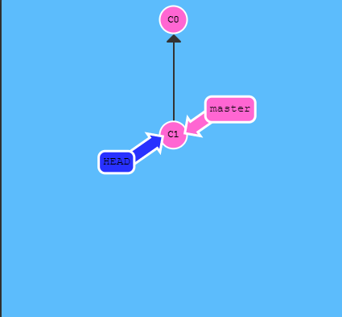

HEAR -> C1

###  2 相对引用 ^ ###

通过指定提交记录哈希值的方式在 Git 中移动不太方便。在实际应用时，并没有像本程序中这么漂亮的可视化提交树供你参考，所以你就不得不用 `git log` 来查查看提交记录的哈希值。

并且哈希值在真实的 Git 世界中也会更长（译者注：基于 SHA-1，共 40 位）。例如前一关的介绍中的提交记录的哈希值可能是 `fed2da64c0efc5293610bdd892f82a58e8cbc5d8`。舌头都快打结了吧...

比较令人欣慰的是，Git 对哈希的处理很智能。你只需要提供能够唯一标识提交记录的前几个字符即可。因此我可以仅输入`fed2` 而不是上面的一长串字符。

通过哈希值指定提交记录很不方便，所以 Git 引入了相对引用。这个就很厉害了!

使用相对引用的话，可以从一个易于记忆的地方（比如 `bugFix` 分支或 `HEAD`）开始计算。

相对引用非常给力，这里我介绍两个简单的用法：

- 使用 `^` 向上移动 1 个提交记录
- 使用 `~<num>` 向上移动多个提交记录，如 `~3`


首先看看操作符 (^)。把这个符号加在引用名称的后面，表示让 Git 寻找指定提交记录的父提交。

所以 `master^` 相当于“`master` 的父节点”。

`master^^` 是 `master` 的第二个父节点

现在咱们切换到 master 的父节点

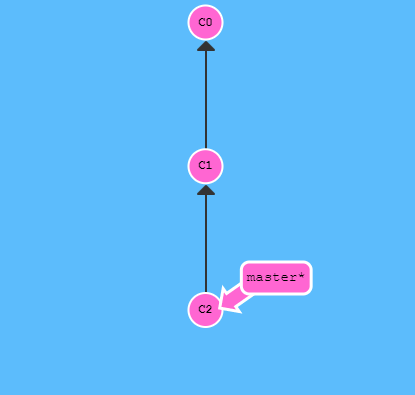

git checkout master^     //相比于 git checkout c1要方便


### 3 相对引用 ~ ###

如果你想在提交树中向上移动很多步的话，敲那么多 `^` 貌似也挺烦人的，Git 当然也考虑到了这一点，于是又引入了操作符 `~`。

该操作符后面可以跟一个数字（可选，不跟数字时与 `^` 相同，向上移动一次），指定向上移动多少次。

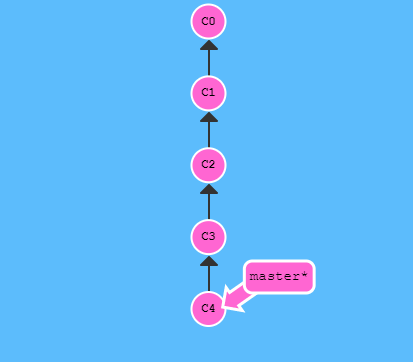

**git checkout HEAD^4**

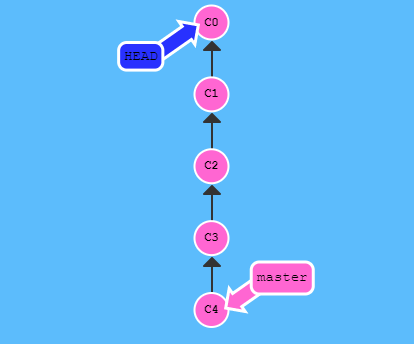

相对引用最多的就是移动分支。可以直接使用 `-f` 选项让分支指向另一个提交。例如: **git branch -f master HEAD~3**

将 master 分支强制指向 HEAD 的第 3 级父提交。**相对引用**为我们提供了一种简洁的引用提交记录 `C1` 的方式， 而 **`-f`** 则容许我们将分支强制移动到那个位置。

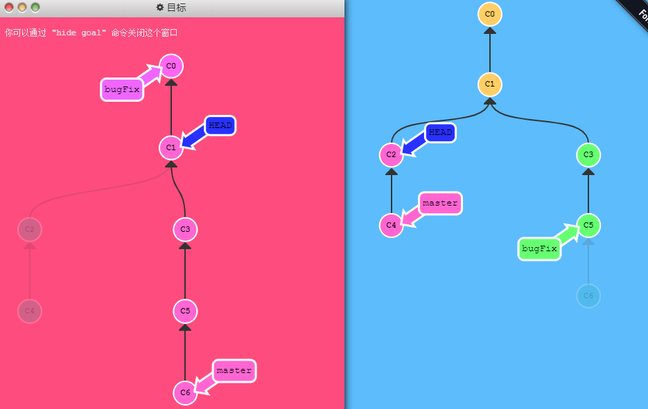

git checkout HEAD^; 

git branch -f master c6; 

git branch -f  bugFix HEAD~1;

**总结**

git checkout xxx            改变HEAD的值，并不会强制移动分支（切换分支斌并不会移动分支，移动的是HEAD）

git branch -f  xxx  ref   强制移动xxx分支，如果xxx是当前分支，那么HEAD也会跟着变

### 4 撤销变更 reset&revert ###

在 Git 里撤销变更的方法很多。和提交一样，撤销变更由底层部分（暂存区的独立文件或者片段）和上层部分（变更到底是通过哪种方式被撤销的）组成。我们这个应用主要关注的是后者。主要有两种方法用来撤销变更 —— 一是 **`git reset`**，还有就是 **`git revert`**。

`git reset` 通过把分支记录回退几个提交记录来实现撤销改动。你可以将这想象成“改写历史”。`git reset` 向上移动分支，原来指向的提交记录就跟从来没有提交过一样。

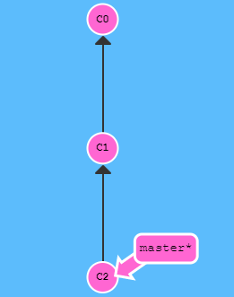

**git reset HEAD~1;**      // 会改变分支的指向

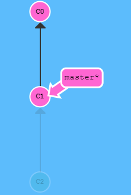

Git 把 master 分支移回到 `C1`；现在我们的本地代码库根本就不知道有 `C2` 这个提交了


虽然在你的本地分支中使用 `git reset` 很方便，但是这种“改写历史”的方法对大家一起使用的远程分支是无效的哦！

为了撤销更改并**分享**给别人，我们需要使用 `git revert`。

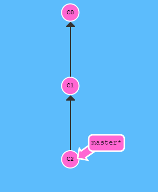

**git revert HEAD;**

在我们要撤销的提交记录后面居然多了一个新提交！这是因为新提交记录 `C2'` 引入了**更改** —— 这些更改刚好是用来撤销 `C2` 这个提交的。也就是说 `C2'` 的状态与 `C1` 是相同的。revert 之后就可以把你的更改推送到远程仓库与别人分享啦。(远程不能回退之前的状态，只能用**与之前状态相同的下一状态**去**覆盖**)

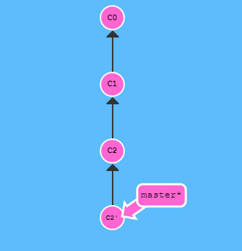

git reset local^;    // 重置到某一次提交

git checkout pushed;

git revert pushed;  // 撤销某一次提交。把这次提交加了的减，减了的加。

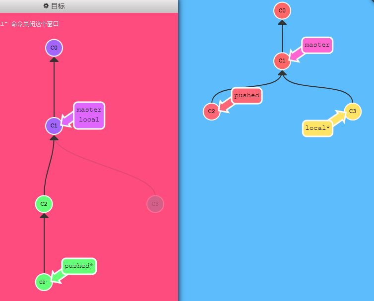

## 移动提交记录 ##

到现在我们已经学习了 Git 的基础知识 —— 提交、分支以及在提交树上移动。 这些概念涵盖了 Git 90% 的功能，同样也足够满足开发者的日常需求

然而, 剩余的 10% 在处理复杂的工作流时(或者当你陷入困惑时）可能就显得尤为重要了。接下来要讨论的这个话题是“整理提交记录” —— 开发人员有时会说“我想要把这个提交放到这里, 那个提交放到刚才那个提交的后面”, 而接下来就讲的就是它的实现方式，非常清晰、灵活，还很生动。

### 1 cherry-pick ###

本系列的第一个命令是 `git cherry-pick`, 命令形式为:

- `git cherry-pick <提交号>...`

如果你想将一些提交复制到当前所在的位置（`HEAD`）下面的话， Cherry-pick 是最直接的方式了。我个人非常喜欢 `cherry-pick`，因为它特别简单。


这里有一个仓库, 我们想将 `side` 分支上的工作复制到 `master` 分支，你立刻想到了之前学过的 `rebase` 了吧？但是咱们还是看看 `cherry-pick` 有什么本领吧。

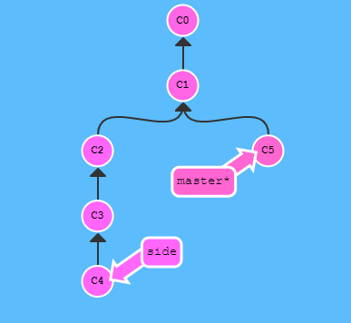

git cherry-pick c2 c4;

我们只需要提交记录 `C2` 和 `C4`，所以 Git 就将被它们抓过来放到当前分支下了。 就是这么简单!

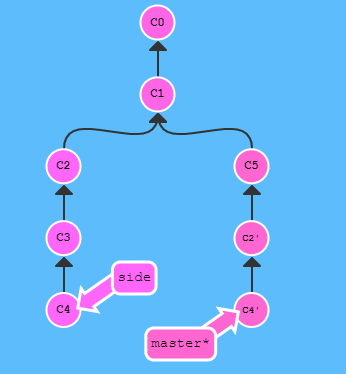

git cherry-pick c3 c4 c7;

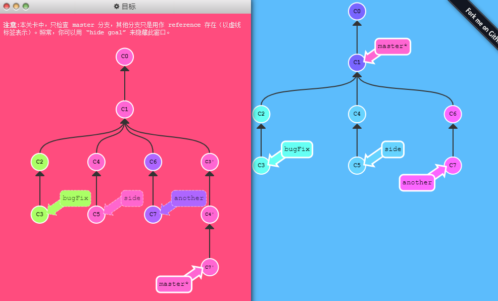

### 2 交互式的rebase ###

当你知道你所需要的提交记录（**并且**还知道这些提交记录的哈希值）时, 用 cherry-pick 再好不过了 —— 没有比这更简单的方式了。

但是如果你不清楚你想要的提交记录的哈希值呢? 幸好 Git 帮你想到了这一点, 我们可以利用交互式的 rebase —— 如果你想从一系列的提交记录中找到想要的记录, 这就是最好的方法了

交互式 rebase 指的是使用带参数 `--interactive` 的 rebase 命令, 简写为 `-i`

如果你在命令后增加了这个选项, Git 会打开一个 UI 界面并列出将要被复制到目标分支的备选提交记录，它还会显示每个提交记录的哈希值和提交说明，提交说明有助于你理解这个提交进行了哪些更改。

当 rebase UI界面打开时, 你能做3件事:

- 调整提交记录的顺序（通过鼠标拖放来完成）
- 删除你不想要的提交（通过切换 `pick` 的状态来完成，关闭就意味着你不想要这个提交记录）
- 合并提交。 遗憾的是由于某种逻辑的原因，我们的课程不支持此功能，因此我不会详细介绍这个操作。简而言之，它允许你把多个提交记录合并成一个。


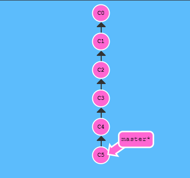

git rebase -i HEAD~4 // 以HEAD~4为父节点(base);

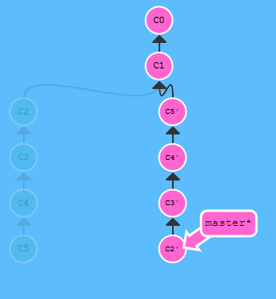

## 杂项 ##

### 1 只取一个提交记录 ###

来看一个在开发中经常会遇到的情况：我正在解决某个特别棘手的 Bug，为了便于调试而在代码中添加了一些调试命令并向控制台打印了一些信息。

这些调试和打印语句都在它们各自的提交记录里。最后我终于找到了造成这个 Bug 的根本原因，解决掉以后觉得沾沾自喜！

最后就差把 `bugFix` 分支里的工作合并回 `master` 分支了。你可以选择通过 fast-forward 快速合并到 `master` 分支上，但这样的话 `master` 分支就会包含我这些调试语句了。你肯定不想这样，应该还有更好的方式……

实际我们只要让 Git 复制解决问题的那一个提交记录就可以了。跟之前我们在“整理提交记录”中学到的一样，我们可以使用

- `git rebase -i`
- `git cherry-pick`

来达到目的。

git checkout master ;  git cherry-pick c4;

git rebase -i master ;   只选择C4;   git rebase bugFix master;


### 2  提交的技巧 ###

接下来这种情况也是很常见的：你之前在 `newImage` 分支上进行了一次提交，然后又基于它创建了 `caption` 分支，然后又提交了一次。

此时你想对的某个以前的提交记录进行一些小小的调整。比如设计师想修改一下 `newImage` 中图片的分辨率，尽管那个提交记录并不是最新的了。


我们可以通过下面的方法来克服困难：

- 先用 `git rebase -i` 将提交重新排序，然后把我们想要修改的提交记录挪到最前
- 然后用 `commit --amend` 来进行一些小修改
- 接着再用 `git rebase -i` 来将他们调回原来的顺序
- 最后我们把 master 移到修改的最前端（用你自己喜欢的方法），就大功告成啦！

当然完成这个任务的方法不止上面提到的一种（我知道你在看 cherry-pick 啦），之后我们会多点关注这些技巧啦，但现在暂时只专注上面这种方法。 最后有必要说明一下目标状态中的那几个`'` —— 我们把这个提交移动了两次，每移动一次会产生一个 `'`；而 C2 上多出来的那个是我们在使用了 amend 参数提交时产生的，所以最终结果就是这样了。

也就是说，我在对比结果的时候只会对比提交树的结构，对于 `'` 的数量上的不同，并不纳入对比范围内。只要你的 `master` 分支结构与目标结构相同，我就算你通过。

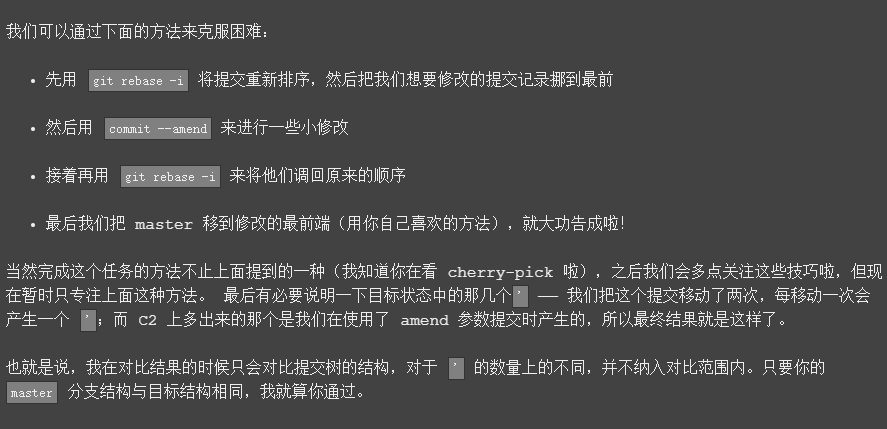

git rebase -i c1;

git commit --amend;

git rebase -i c1;

git checkout master;

git merge caption;


git rebase -i HEAD~2;

git commit --amend;

git rebase -i c1;

git rebase caption master;

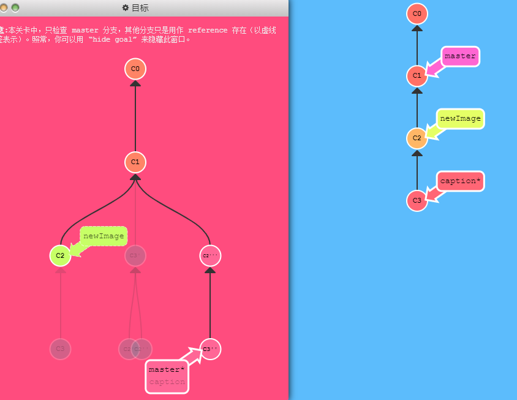

### 3 提交的技巧 ###

正如你在上一关所见到的，我们可以使用 `rebase -i` 对提交记录进行重新排序。只要把我们想要的提交记录挪到最前端，我们就可以很轻松的用 `--amend` 修改它，然后把它们重新排成我们想要的顺序。

但这样做就唯一的问题就是要进行两次排序，而这有可能造成由 rebase 而导致的冲突。下面还是看看 `git cherry-pick` 是怎么做的吧。

牢记 cherry-pick 可以将**提交树上任何地方的提交记录取过来追加到 HEAD 上**（只要不是 HEAD 上游的提交就没问题）


git checkout master;

git cherry-pick c2;

git commit --amend;

git cherry-pick caption;


### 4 git tags ###

相信通过前面课程的学习你已经发现了：分支很容易被人为移动，并且当有新的提交时，它也会移动。分支很容易被改变，大部分分支还只是临时的，并且还一直在变。

你可能会问了：有没有什么可以*永远*指向某个提交记录的标识呢，比如软件发布新的大版本，或者是修正一些重要的 Bug 或是增加了某些新特性，有没有比分支更好的可以永远指向这些提交的方法呢？

Git 的 tag 就是干这个用的啊，它们可以（在某种程度上 —— 因为标签可以被删除后重新在另外一个位置创建同名的标签）永久地将某个特定的提交命名为里程碑，然后就可以像分支一样引用了。

更难得的是，它们并不会随着新的提交而移动。你也不能检出到某个标签上面进行修改提交，它就像是提交树上的一个锚点，标识了某个特定的位置。

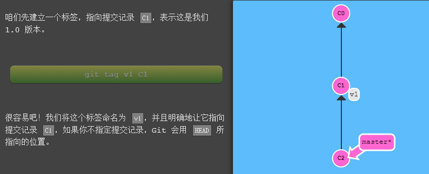

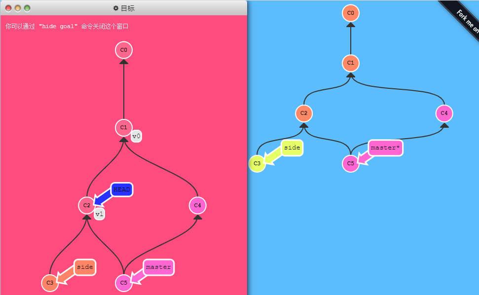

git tag v0 master~2;

git tag v1 side~;

git checkout v1;


### 5 git describe ###

由于标签在代码库中起着“锚点”的作用，Git 还为此专门设计了一个命令用来**描述**离你最近的锚点（也就是标签），它就是 `git describe`！

Git Describe 能帮你在提交历史中移动了多次以后找到方向

`git describe` 的语法是：

```
git describe <ref>
```

`<ref>` 可以是任何能被 Git 识别成提交记录的引用，如果你没有指定的话，Git 会以你目前所检出的位置（`HEAD`）。

它输出的结果是这样的：

```
<tag>_<numCommits>_g<hash>
```

`tag` 表示的是离 `ref` 最近的标签， `numCommits` 是表示这个 `ref` 与 `tag` 相差有多少个提交记录， `hash` 表示的是你所给定的 `ref` 所表示的提交记录哈希值的前几位。

当 `ref` 提交记录上有某个标签时，则只输出标签名称

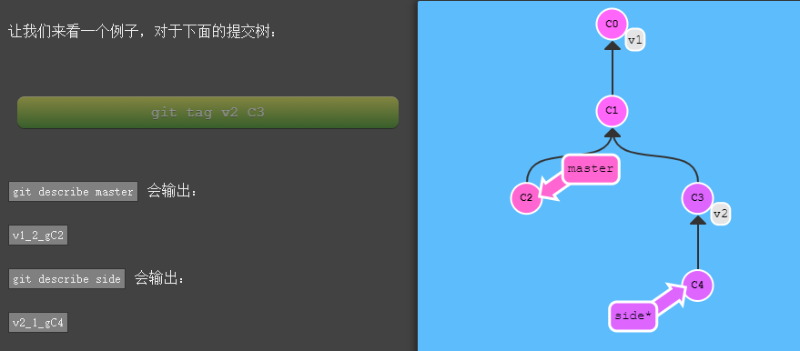

### 6 多次rebase ###

希望得到有序的提交历史，也就是我们最终的结果应该是 `C6'` 在 `C7'` 上面， `C5'` 在 `C6'` 上面，依此类推。

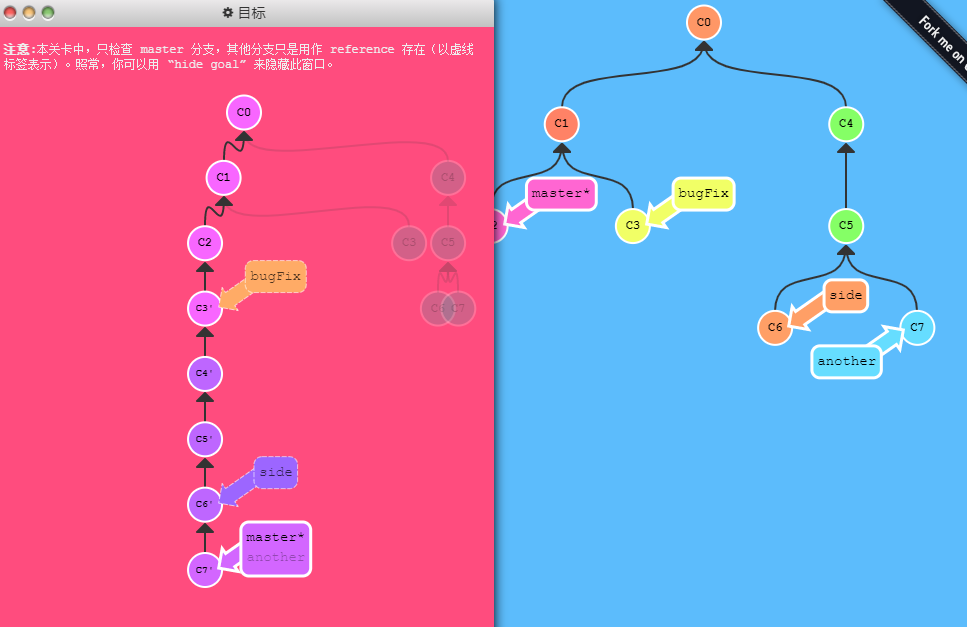

git rebase master bugFix;

git rebase  bugFix side ;

git rebase side another;

git rebase another master;


### 7 多个父节点 ###

操作符 `^` 与 `~` 符一样，后面也可以跟一个数字。**指定父提交**。

但是该操作符后面的数字与 `~` 后面的不同，并不是用来指定向上返回几代，而是指定合并提交记录的某个父提交。还记得前面提到过的一个合并提交有两个父提交吧，所以遇到这样的节点时该选择哪条路径就不是很清晰了。

Git 默认选择合并提交的“第一个”父提交，在操作符 `^` 后跟一个数字可以改变这一默认行为。

**git checkout master^;**


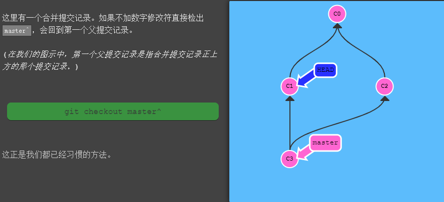

**git checkout master^2;**

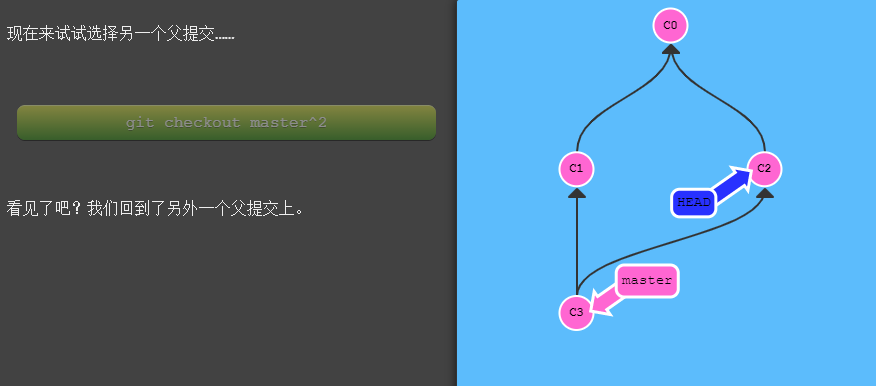

git checkout HEAD~; git checkout HEAD^2; git checkout HEAD~2;  ------>  链式操作   **git checkout HEAD\~^2~2;**

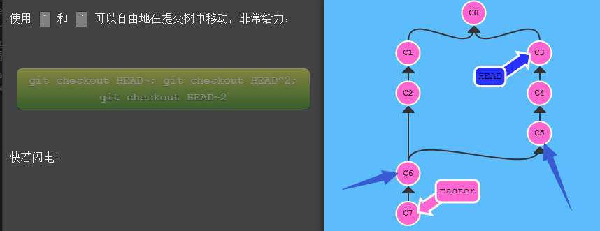

**git branch bugWork master\^\^2^;**

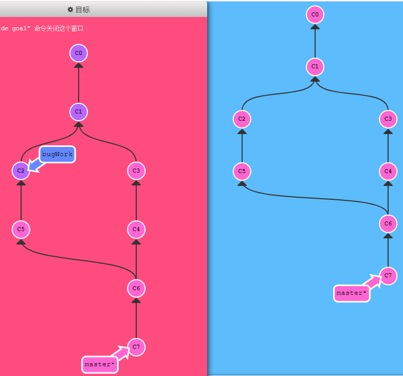

[1](./.assets/1.c)

